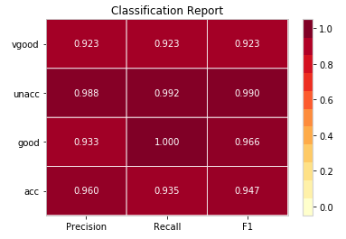
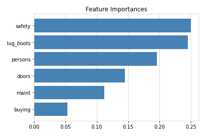

# CART
Implementation of a decision tree from scratch using the CART algorithm. A package is available and an application in a Jupyter Notebook.

**Methods**
- build
- predict
- accuracy
- classification_report(precision, recall, f1) + visualization
- feature_importances + visualization
- get_depth
- get_n_leaves
- print_tree

**Hyperparameters**
- max_depth
- min_samples_split

## Example results in Car Evaluation Data Set

.
